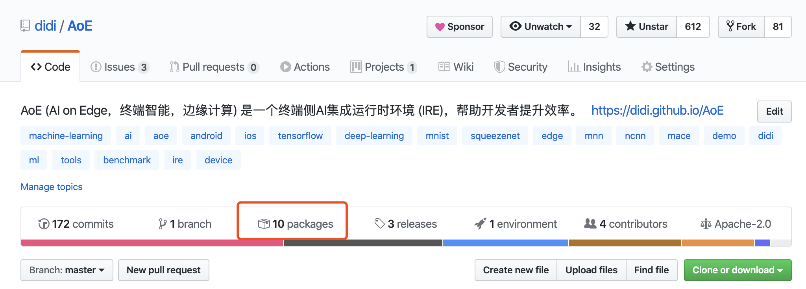
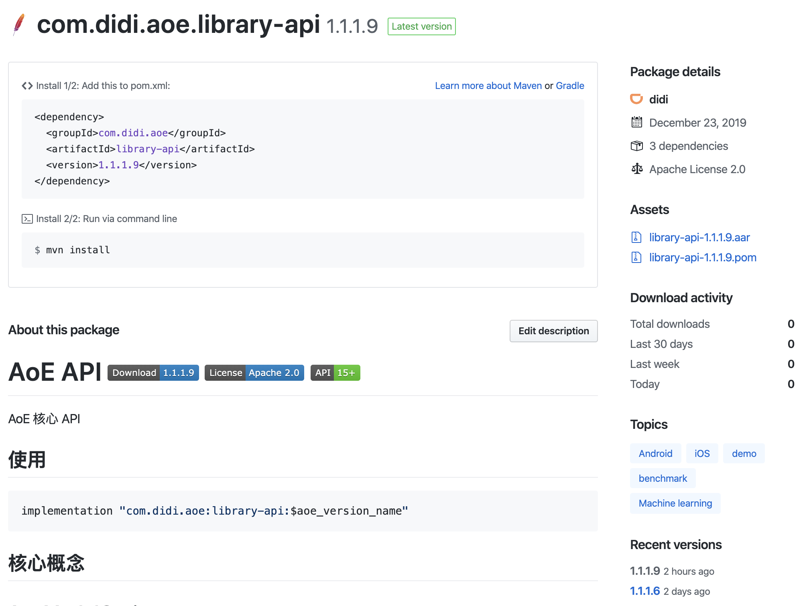
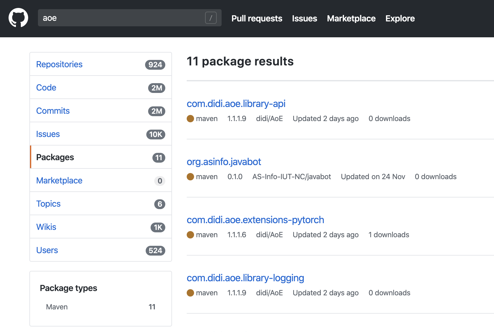

## 背景
Github 提供了简便的包管理工具 Github Package Registry（以下简称GPR），对于 Android 项目如何轻松发布和获取自己的 Android 库。

起初我将包通过 bintray 发布到私有 maven 仓库，然后同步到 jcenter，但是 bintray 的服务很不稳定，导致我在包发布的过程中经常因为网络问题中断，无法自动化。然后新发布的库，第一次同步到 jcenter 需手动提交申请，人工审核通过后才能同步到 jcenter。

归纳下来，需要 GPR 的理由有三：
* 开源项目，内网私仓信息要去除，不可用
* jcenter / mavenCenter 服务在国内不稳定，很难用，但又是用户使用体验最好的方式
* GPR 出自 Github，代码和包闭环管理是刚需

当然问题也是有的，一会我会讲。

## 发布自己的库到 GPR
以我的一个开源项目 AoE [https://github.com/didi/AoE](https://github.com/didi/aoe) 为例（本文假设读者对Github & Git足够熟悉，知道Github token等概念）

### 1 android-maven-publish 插件
Github 目前提供 Gradle 方式 maven 插件支持有限，官方文档简单介绍了一下Java工程的使用，对于android工程可以使用 digital.wup:android-maven-publish 进行相应的aar包push

#### 1.1 项目 build.gradle 配置插件依赖
```gradle
buildscript {
    dependencies {
        classpath 'digital.wup:android-maven-publish:3.6.3'
    }
}
```

#### 1.2 库 gradle 脚本应用插件，提供相关配置

```gradle
apply plugin: 'digital.wup.android-maven-publish'

Properties properties = new Properties()
File propertiesFile = project.rootProject.file('local.properties')
if (propertiesFile.exists()) {
    InputStream inputStream = propertiesFile.newDataInputStream()
    properties.load(inputStream)
}

publishing {
    repositories {
        maven {
            url 'https://maven.pkg.github.com/didi/aoe' // 项目地址 ： https://maven.pkg.github.com/{user or org}/{repo}
            credentials {
                username = properties.getProperty("gpr.user") ?: System.getenv("GPR_USER")
                password = properties.getProperty("gpr.key") ?: System.getenv("GPR_API_KEY")
            }
        }
    }
    publications {
        gpr(MavenPublication) {
            version releaseVersion // 发布版本
            groupId = 'com.didi.aoe' // group名
            artifactId = releaseArtifact // artifact名
            from(components.android)
        }
    }
}
```
我在项目根目录下local.properties 配置了 username & pwd ,同时提供了Actions自动化构建的方式获取属性，可以根自己需求配置，其中的pwd需要自己到设置里生成一个有包管理权限的token。

### 2 发布包

```shell
./gradlew :{module}:publish
```
替换自己module名，调用task publish进行发布

以AoE的library-api为例，发布后，在项目可以看到自己package发布情况：


即可进入上传module的包，可以清楚看到自己的包被GPR方式依赖的情况，还有历史版本的信息，标签信息，以及包下载地址和引用方式，可自行编辑说明文档（markdown）


### 3 查找包
当然你发布的包除了项目地址以外，能很容易被搜索到：



## 项目中使用 GPR 的aar包

和正常通过gradle 方式引用依赖一样

```gradle
implementation "com.didi.aoe:library-api:$aoe_version_name"
```

但是有一点不方便的地方，就是需要引入你的私仓，并且通过 username/pwd 认证

```gradle
buildscript {
    maven {
        url 'https://maven.pkg.github.com/didi/aoe'
        credentials {
            username = {username}
            password = {token}
        }
    }
}

allprojects {
    maven {
        url 'https://maven.pkg.github.com/didi/aoe'
        credentials {
            username = {username}
            password = {token}
        }
    }
}

```